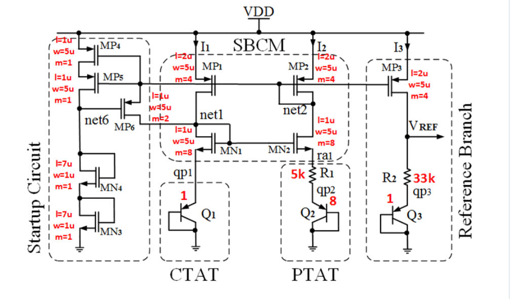
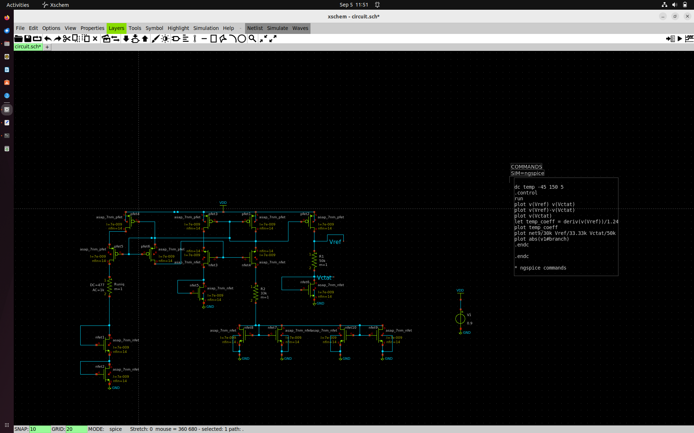
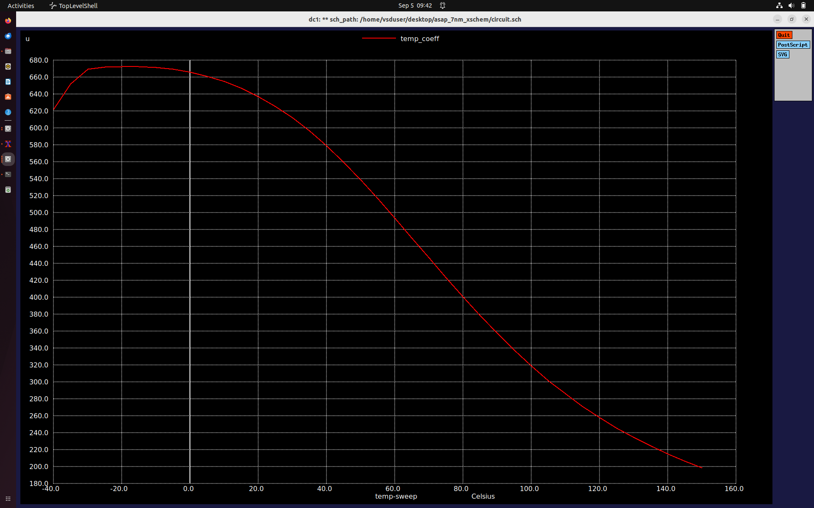
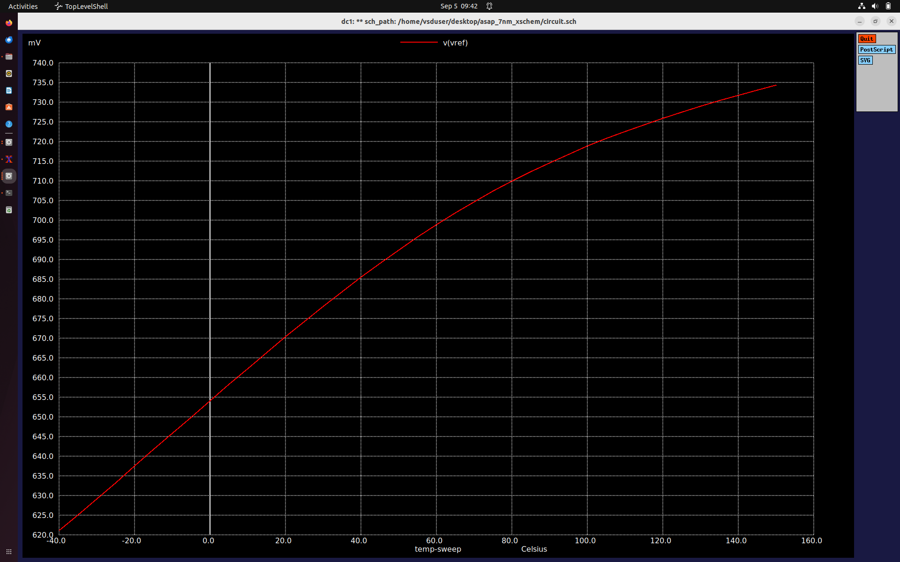
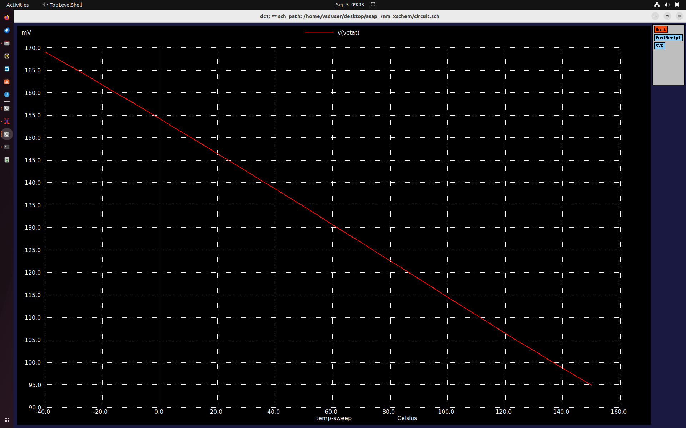
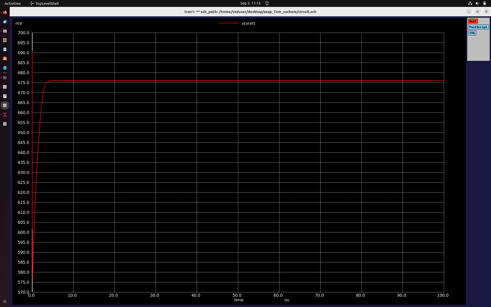

# 7nm-FinFET-Circuit-Design-and-Characterization

## Characterization of a 7nm FinFET Inverter
Modified SPICE Deck
```

** sch_path: /home/maddy/asap_7nm_Xschem/inverter_vtc.sch
**.subckt inverter_vtc
Xpfet1 nfet_out nfet_in vdd vdd asap_7nm_pfet l=7e-009 nfin=15
Xnfet1 nfet_out nfet_in GND GND asap_7nm_nfet l=7e-009 nfin=16
V1 nfet_in GND pulse(0 0.7 20p 10p 10p 20p 500p 1)
V2 vdd GND 0.7

Vuniq in 0 DC 0.477 

**** begin user architecture code


.dc v1 0 0.7 1m
*.tran 1e-12 100e-12

.control
    * First run DC
    dc v1 0 0.7 1m
    run

    * DC measurements
    meas dc v_th when nfet_out = nfet_in
    plot nfet_out nfet_in
    
    let gain_av = abs(deriv(nfet_out))
    plot gain_av
    meas dc max_gain max gain_av
    let gain_target = max_gain * 0.999
    meas dc vil find nfet_in when gain_av = gain_target cross=1
    meas dc voh find nfet_out when gain_av = gain_target cross=1
    meas dc vih find nfet_in when gain_av = gain_target cross=2
    meas dc vol find nfet_out when gain_av = gain_target cross=2
    let nmh = voh - vih
    let nml = vil - vol
    print v_th max_gain vil voh vih vol nmh nml
    
    *Transconductance
    
    let id = v2#branch
    let gm = real(deriv(id, nfet_in))
    meas dc gm_max MAX gm
    plot gm
    let r_out= deriv(nfet_out,id)
    plot r_out
    plot id
    
    
    * Transient measurements
    tran 1e-12 100e-12
    meas tran tpr when nfet_in = 0.35 rise = 1
    meas tran tpf when nfet_out = 0.35 fall = 1
    let tp = (tpr + tpf) / 2
    let trans_current = v2#branch
    meas tran id_pwr integ trans_current from=2e-11 to=6e-11
    let pwr = id_pwr * 0.7
    let power = abs(pwr / 40e-12)
    print tpr tpf tp id_pwr pwr power
  
    tran 0.1 100p                         
    meas tran tr when nfet_in=0.07 RISE=1  
    meas tran tf when nfet_out=0.63 FALL=1 
    let t_delay = tr + tf                  
    print t_delay                         
    let f = 1/t_delay                     
    print f                              

    

.endc


**** end user architecture code
**.ends
.GLOBAL GND
**** begin user architecture code

.subckt asap_7nm_pfet S G D B l=7e-009 nfin=15
	npmos_finfet S G D B BSIMCMG_osdi_P l=7e-009 nfin=16
.ends asap_7nm_pfet

.model BSIMCMG_osdi_P BSIMCMG_va (
+ TYPE = 0

************************************************************
*                         general                          *
************************************************************
+version = 107             bulkmod = 1               igcmod  = 1               igbmod  = 0
+gidlmod = 1               iimod   = 0               geomod  = 1               rdsmod  = 0
+rgatemod= 0               rgeomod = 0               shmod   = 0               nqsmod  = 0
+coremod = 0               cgeomod = 0               capmod  = 0               tnom    = 25
+eot     = 1e-009          eotbox  = 1.4e-007        eotacc  = 3e-010          tfin    = 6.5e-009
+toxp    = 2.1e-009        nbody   = 1e+022          phig    = 4.9278          epsrox  = 3.9
+epsrsub = 11.9            easub   = 4.05            ni0sub  = 1.1e+016        bg0sub  = 1.17
+nc0sub  = 2.86e+025       nsd     = 2e+026          ngate   = 0               nseg    = 5
+l       = 2.1e-008        xl      = 1e-009          lint    = -2.5e-009       dlc     = 0
+dlbin   = 0               hfin    = 3.2e-008        deltaw  = 0               deltawcv= 0
+sdterm  = 0               epsrsp  = 3.9             nfin    = 1
+toxg    = 1.8e-009
************************************************************
*                            dc                            *
************************************************************
+cit     = 0               cdsc    = 0.003469        cdscd   = 0.001486        dvt0    = 0.05
+dvt1    = 0.36            phin    = 0.05            eta0    = 0.094           dsub    = 0.24
+k1rsce  = 0               lpe0    = 0               dvtshift= 0               qmfactor= 0
+etaqm   = 0.54            qm0     = 2.183e-012      pqm     = 0.66            u0      = 0.0237
+etamob  = 4               up      = 0               ua      = 1.133           eu      = 0.05
+ud      = 0.0105          ucs     = 0.2672          rdswmin = 0               rdsw    = 200
+wr      = 1               rswmin  = 0               rdwmin  = 0               rshs    = 0
+rshd    = 0               vsat    = 60000           deltavsat= 0.17            ksativ  = 1.592
+mexp    = 2.491           ptwg    = 25              pclm    = 0.01            pclmg   = 1
+pdibl1  = 800             pdibl2  = 0.005704        drout   = 4.97            pvag    = 200
+fpitch  = 2.7e-008        rth0    = 0.15            cth0    = 1.243e-006      wth0    = 2.6e-007
+lcdscd  = 0               lcdscdr = 0               lrdsw   = 1.3             lvsat   = 1441
************************************************************
*                         leakage                          *
************************************************************
+aigc    = 0.007           bigc    = 0.0015          cigc    = 1               dlcigs  = 5e-009
+dlcigd  = 5e-009          aigs    = 0.006           aigd    = 0.006           bigs    = 0.001944
+bigd    = 0.001944        cigs    = 1               cigd    = 1               poxedge = 1.152
+agidl   = 2e-012          agisl   = 2e-012          bgidl   = 1.5e+008        bgisl   = 1.5e+008
+egidl   = 1.142           egisl   = 1.142
************************************************************
*                            rf                            *
************************************************************
************************************************************
*                         junction                         *
************************************************************
************************************************************
*                       capacitance                        *
************************************************************
+cfs     = 0               cfd     = 0               cgso    = 1.6e-010        cgdo    = 1.6e-010
+cgsl    = 0               cgdl    = 0               ckappas = 0.6             ckappad = 0.6
+cgbo    = 0               cgbl    = 0
************************************************************
*                       temperature                        *
************************************************************
+tbgasub = 0.000473        tbgbsub = 636             kt1     = 0               kt1l    = 0
+ute     = -1.2            utl     = 0               ua1     = 0.001032        ud1     = 0
+ucste   = -0.004775       at      = 0.001           ptwgt   = 0.004           tmexp   = 0
+prt     = 0               tgidl   = -0.007          igt     = 2.5
************************************************************
*                          noise                           *
************************************************************
**)
.control
pre_osdi /home/vsduser/Desktop/asap_7nm_Xschem/bsimcmg.osdi
.endc


.subckt asap_7nm_nfet S G D B l=7e-009 nfin=14
	nnmos_finfet S G D B BSIMCMG_osdi_N l=7e-009 nfin=14
.ends asap_7nm_nfet

.model BSIMCMG_osdi_N BSIMCMG_va (
+ TYPE = 1
************************************************************
*                         general                          *
************************************************************
+version = 107             bulkmod = 1               igcmod  = 1               igbmod  = 0
+gidlmod = 1               iimod   = 0               geomod  = 1               rdsmod  = 0
+rgatemod= 0               rgeomod = 0               shmod   = 0               nqsmod  = 0
+coremod = 0               cgeomod = 0               capmod  = 0               tnom    = 25
+eot     = 1e-009          eotbox  = 1.4e-007        eotacc  = 1e-010          tfin    = 6.5e-009
+toxp    = 2.1e-009        nbody   = 1e+022          phig    = 4.2466          epsrox  = 3.9
+epsrsub = 11.9            easub   = 4.05            ni0sub  = 1.1e+016        bg0sub  = 1.17
+nc0sub  = 2.86e+025       nsd     = 2e+026          ngate   = 0               nseg    = 5
+l       = 2.1e-008        xl      = 1e-009          lint    = -2e-009         dlc     = 0
+dlbin   = 0               hfin    = 3.2e-008        deltaw  = 0               deltawcv= 0
+sdterm  = 0               epsrsp  = 3.9             nfin    = 1
+toxg    = 1.80e-009
************************************************************
*                            dc                            *
************************************************************
+cit     = 0               cdsc    = 0.01            cdscd   = 0.01            dvt0    = 0.05
+dvt1    = 0.47            phin    = 0.05            eta0    = 0.07            dsub    = 0.35
+k1rsce  = 0               lpe0    = 0               dvtshift= 0               qmfactor= 2.5
+etaqm   = 0.54            qm0     = 0.001           pqm     = 0.66            u0      = 0.0303
+etamob  = 2               up      = 0               ua      = 0.55            eu      = 1.2
+ud      = 0               ucs     = 1               rdswmin = 0               rdsw    = 200
+wr      = 1               rswmin  = 0               rdwmin  = 0               rshs    = 0
+rshd    = 0               vsat    = 70000           deltavsat= 0.2             ksativ  = 2
+mexp    = 4               ptwg    = 30              pclm    = 0.05            pclmg   = 0
+pdibl1  = 0               pdibl2  = 0.002           drout   = 1               pvag    = 0
+fpitch  = 2.7e-008        rth0    = 0.225           cth0    = 1.243e-006      wth0    = 2.6e-007
+lcdscd  = 5e-005          lcdscdr = 5e-005          lrdsw   = 0.2             lvsat   = 0
************************************************************
*                         leakage                          *
************************************************************
+aigc    = 0.014           bigc    = 0.005           cigc    = 0.25            dlcigs  = 1e-009
+dlcigd  = 1e-009          aigs    = 0.0115          aigd    = 0.0115          bigs    = 0.00332
+bigd    = 0.00332         cigs    = 0.35            cigd    = 0.35            poxedge = 1.1
+agidl   = 1e-012          agisl   = 1e-012          bgidl   = 10000000        bgisl   = 10000000
+egidl   = 0.35            egisl   = 0.35
************************************************************
*                            rf                            *
************************************************************
************************************************************
*                         junction                         *
************************************************************
************************************************************
*                       capacitance                        *
************************************************************
+cfs     = 0               cfd     = 0               cgso    = 1.6e-010        cgdo    = 1.6e-010
+cgsl    = 0               cgdl    = 0               ckappas = 0.6             ckappad = 0.6
+cgbo    = 0               cgbl    = 0
************************************************************
*                       temperature                        *
************************************************************
+tbgasub = 0.000473        tbgbsub = 636             kt1     = 0               kt1l    = 0
+ute     = -0.7            utl     = 0               ua1     = 0.001032        ud1     = 0
+ucste   = -0.004775       at      = 0.001           ptwgt   = 0.004           tmexp   = 0
+prt     = 0               tgidl   = -0.007          igt     = 2.5
************************************************************
*                          noise                           *
************************************************************
**)
.control
pre_osdi /home/vsduser/Desktop/asap_7nm_Xschem/bsimcmg.osdi
.endc


**** end user architecture code
.end
```
### Switching Threshold voltage (VTC)
The switching threshold voltage of an inverter is the input voltage at which the output voltage equals the input voltage on the voltage transfer characteristic (VTC) curve. The threshold voltage can shift left or right depending on the sizing of the PMOS and NMOS transistors.

SPICE Command:
``` meas dc v_th when nfet_out=nfet_in ```

### Drain Current (Id)
Drain current (Id) is the current flowing from the source to the drain of a FinFET when a gate voltage is applied and a voltage is present between the source and drain.

In a linear region, Id increases linearly with respect to Vds

In the saturation region (i.e when Vds > Vgs-Vth), Id becomes independent of the applied voltage, and the transistor behaves like a constant current source.

Unlike planar MOSFETs, a FinFET has a 3D structure where the channel is wrapped by the gate on three sides, providing better electrostatic control over the channel.

SPICE Command:
```
let id = v2#branch
plot id

```
### Power Consumption (P)

Power consumption is the integral of the product of supply voltage (Vdd) and transient current over a time period.

SPICE Command:

``` 
let trans_current = v2#branch
    meas tran id_pwr integ trans_current from=2e-11 to=6e-11
    let pwr = id_pwr * 0.7
    let power = abs(pwr / 40e-12)
    print power
```

### Propagation Delay (Tp)
Propagation delay is the time taken for a signal to propagate through the inverter, measured from 50% of the input rise/fall voltage to 50% of the output fall/rise voltage.

Rise time (Tr): Time taken for the output to rise from 10% to 90% of its maximum value.
Fall time (Tf): Time taken for the output to fall from 90% to 10% of its maximum value.

SPICE Command:
```
    meas tran tpr when nfet_in = 0.35 rise = 1
    meas tran tpf when nfet_out = 0.35 fall = 1
    let tp = (tpr + tpf) / 2
    print tp
```

### Gain (Av)
Voltage gain is defined as the rate of change of output voltage with respect to the input voltage.

SPICE Command:
```
let gain_av = abs(deriv(nfet_out))
plot gain_av

```
### Noise Margin (NM)
The noise margin of an inverter measures its tolerance to input noise while still correctly recognizing logic levels. It is defined using four voltage parameters:

VIL: Maximum input voltage recognized as logic low
VIH: Minimum input voltage recognized as logic high
VOL: Output voltage for logic low
VOH: Output voltage for logic high


Noise Margin High (NMH) is given as, NMH = VOH - VIH

Any input signal within this range is detected as logic HIGH.

Noise Margin Low (NML) is given as, NML = VIL - VOL

Any input signal within this range is detected as logic LOW.

SPICE Command:
```
    meas dc vil find nfet_in when gain_av = gain_target cross=1 
    meas dc voh find nfet_out when gain_av = gain_target cross=1
    meas dc vih find nfet_in when gain_av = gain_target cross=2
    meas dc vol find nfet_out when gain_av = gain_target cross=2
    let nmh = voh - vih
    let nml = vil - vol
```

### Transconductance (gm)
It is the ratio of the change in drain current (Id) to the change in gate to source voltage (Vgs).
SPICE Command:
```
   let gm = real(deriv(id, nfet_in))
    meas dc gm_max MAX gm
    plot gm
```

### Frequency
It is calculated as the inverse of total propagation delay.

F = 1/(tr+tf)

SPICE Command:
```
    tran 0.1 100p                         
    meas tran tr when nfet_in=0.07 RISE=1  
    meas tran tf when nfet_out=0.63 FALL=1 
    let t_delay = tr + tf                  
    print t_delay                         
    let f = 1/t_delay                     
    print f      

```
## 7nm FinFET Bandgap Reference Design and Simulation using Xschem

A bandgap reference circuit provides a stable voltage that is largely independent of temperature and supply variations. It achieves this by combining a CTAT voltage (which decreases with temperature) and a PTAT voltage (which increases with temperature), so that their temperature effects cancel out, resulting in a nearly constant reference voltage around 1.2 V. 

In this work, the bandgap circuit has been implemented using the ASAP 7 nm FinFET PDK, leveraging the advantages of FinFET devices to achieve a compact and high-performance design suitable for modern VLSI applications.

<picture>

</picture>

Implemented the schematic with a unique resistor of value 477 Ω

<picture>

</picture>

spice netlist of implemented schematic:

```
** sch_path: /home/vsduser/Desktop/asap_7nm_Xschem/circuit.sch
**.subckt circuit
Xpfet1 net1 net1 VDD net13 asap_7nm_pfet l=7e-009 nfin=14
Xpfet2 Vref net1 VDD net14 asap_7nm_pfet l=7e-009 nfin=14
Xpfet3 net2 net1 VDD VDD asap_7nm_pfet l=7e-009 nfin=14
Xpfet4 net5 net1 VDD net12 asap_7nm_pfet l=7e-009 nfin=14
Xpfet5 net15 net1 net5 net16 asap_7nm_pfet l=7e-009 nfin=14
Xpfet6 net3 net1 net1 net17 asap_7nm_pfet l=7e-009 nfin=14
Xnfet1 net8 net8 net7 net18 asap_7nm_nfet l=7e-009 nfin=14
Xnfet2 net7 net7 GND net19 asap_7nm_nfet l=7e-009 nfin=14
Xnfet3 net4 net3 net2 net20 asap_7nm_nfet l=7e-009 nfin=14
Xnfet4 net6 net3 net1 net21 asap_7nm_nfet l=7e-009 nfin=14
Xnfet5 net4 net4 GND net10 asap_7nm_nfet l=7e-009 nfin=14
Xnfet6 Vctat Vctat GND net11 asap_7nm_nfet l=7e-009 nfin=14
Xnfet7 net9 net9 GND GND asap_7nm_nfet l=7e-009 nfin=14
Xnfet8 net9 net9 GND GND asap_7nm_nfet l=7e-009 nfin=14
Xnfet9 net9 net9 GND GND asap_7nm_nfet l=7e-009 nfin=14
Xnfet10 net9 net9 GND GND asap_7nm_nfet l=7e-009 nfin=14
R1 Vref Vctat 50k m=1
R2 net6 net9 33k m=1
V1 VDD GND 0.8
Runiq net15 net8 477 ac=1k m=1
**** begin user architecture code

dc temp -45 150 5
.control
run
plot v(Vref) v(Vctat)
plot v(Vref)-v(Vctat)
plot v(Vctat)
let temp_coeff = deriv(v(Vref))/1.24
plot temp_coeff
plot net9/30k Vref/33.33k Vctat/50k
plot abs(v1#branch)
.endc


.tran 10u 2m uic
.temp -40
.control
pre_osdi /home/vsduser/Desktop/asap_7nm_Xschem/bsimcmg.osdi
run
meas trans vref_final FIND v(vref) AT=1.99m
meas tran t_99 WHEN v(vref)=0.99*vref_final FALL=1
print t_99
plot v(Vctat)
plot v(Vref)
* ngspice commands


**** end user architecture code
**.ends
.GLOBAL GND
.GLOBAL VDD
**** begin user architecture code

.subckt asap_7nm_pfet S G D B l=7e-009 nfin=14
	npmos_finfet S G D B BSIMCMG_osdi_P l=7e-009 nfin=14
.ends asap_7nm_pfet

.model BSIMCMG_osdi_P BSIMCMG_va (
+ TYPE = 0

************************************************************
*                         general                          *
************************************************************
+version = 107             bulkmod = 1               igcmod  = 1               igbmod  = 0
+gidlmod = 1               iimod   = 0               geomod  = 1               rdsmod  = 0
+rgatemod= 0               rgeomod = 0               shmod   = 0               nqsmod  = 0
+coremod = 0               cgeomod = 0               capmod  = 0               tnom    = 25
+eot     = 1e-009          eotbox  = 1.4e-007        eotacc  = 3e-010          tfin    = 6.5e-009
+toxp    = 2.1e-009        nbody   = 1e+022          phig    = 4.9278          epsrox  = 3.9
+epsrsub = 11.9            easub   = 4.05            ni0sub  = 1.1e+016        bg0sub  = 1.17
+nc0sub  = 2.86e+025       nsd     = 2e+026          ngate   = 0               nseg    = 5
+l       = 2.1e-008        xl      = 1e-009          lint    = -2.5e-009       dlc     = 0
+dlbin   = 0               hfin    = 3.2e-008        deltaw  = 0               deltawcv= 0
+sdterm  = 0               epsrsp  = 3.9             nfin    = 1
+toxg    = 1.8e-009
************************************************************
*                            dc                            *
************************************************************
+cit     = 0               cdsc    = 0.003469        cdscd   = 0.001486        dvt0    = 0.05
+dvt1    = 0.36            phin    = 0.05            eta0    = 0.094           dsub    = 0.24
+k1rsce  = 0               lpe0    = 0               dvtshift= 0               qmfactor= 0
+etaqm   = 0.54            qm0     = 2.183e-012      pqm     = 0.66            u0      = 0.0237
+etamob  = 4               up      = 0               ua      = 1.133           eu      = 0.05
+ud      = 0.0105          ucs     = 0.2672          rdswmin = 0               rdsw    = 200
+wr      = 1               rswmin  = 0               rdwmin  = 0               rshs    = 0
+rshd    = 0               vsat    = 60000           deltavsat= 0.17            ksativ  = 1.592
+mexp    = 2.491           ptwg    = 25              pclm    = 0.01            pclmg   = 1
+pdibl1  = 800             pdibl2  = 0.005704        drout   = 4.97            pvag    = 200
+fpitch  = 2.7e-008        rth0    = 0.15            cth0    = 1.243e-006      wth0    = 2.6e-007
+lcdscd  = 0               lcdscdr = 0               lrdsw   = 1.3             lvsat   = 1441
************************************************************
*                         leakage                          *
************************************************************
+aigc    = 0.007           bigc    = 0.0015          cigc    = 1               dlcigs  = 5e-009
+dlcigd  = 5e-009          aigs    = 0.006           aigd    = 0.006           bigs    = 0.001944
+bigd    = 0.001944        cigs    = 1               cigd    = 1               poxedge = 1.152
+agidl   = 2e-012          agisl   = 2e-012          bgidl   = 1.5e+008        bgisl   = 1.5e+008
+egidl   = 1.142           egisl   = 1.142
************************************************************
*                            rf                            *
************************************************************
************************************************************
*                         junction                         *
************************************************************
************************************************************
*                       capacitance                        *
************************************************************
+cfs     = 0               cfd     = 0               cgso    = 1.6e-010        cgdo    = 1.6e-010
+cgsl    = 0               cgdl    = 0               ckappas = 0.6             ckappad = 0.6
+cgbo    = 0               cgbl    = 0
************************************************************
*                       temperature                        *
************************************************************
+tbgasub = 0.000473        tbgbsub = 636             kt1     = 0               kt1l    = 0
+ute     = -1.2            utl     = 0               ua1     = 0.001032        ud1     = 0
+ucste   = -0.004775       at      = 0.001           ptwgt   = 0.004           tmexp   = 0
+prt     = 0               tgidl   = -0.007          igt     = 2.5
************************************************************
*                          noise                           *
************************************************************
**)
.control
pre_osdi /home/vsduser/Desktop/asap_7nm_Xschem/bsimcmg.osdi
.endc


.subckt asap_7nm_nfet S G D B l=7e-009 nfin=14
	nnmos_finfet S G D B BSIMCMG_osdi_N l=7e-009 nfin=14
.ends asap_7nm_nfet

.model BSIMCMG_osdi_N BSIMCMG_va (
+ TYPE = 1
************************************************************
*                         general                          *
************************************************************
+version = 107             bulkmod = 1               igcmod  = 1               igbmod  = 0
+gidlmod = 1               iimod   = 0               geomod  = 1               rdsmod  = 0
+rgatemod= 0               rgeomod = 0               shmod   = 0               nqsmod  = 0
+coremod = 0               cgeomod = 0               capmod  = 0               tnom    = 25
+eot     = 1e-009          eotbox  = 1.4e-007        eotacc  = 1e-010          tfin    = 6.5e-009
+toxp    = 2.1e-009        nbody   = 1e+022          phig    = 4.2466          epsrox  = 3.9
+epsrsub = 11.9            easub   = 4.05            ni0sub  = 1.1e+016        bg0sub  = 1.17
+nc0sub  = 2.86e+025       nsd     = 2e+026          ngate   = 0               nseg    = 5
+l       = 2.1e-008        xl      = 1e-009          lint    = -2e-009         dlc     = 0
+dlbin   = 0               hfin    = 3.2e-008        deltaw  = 0               deltawcv= 0
+sdterm  = 0               epsrsp  = 3.9             nfin    = 1
+toxg    = 1.80e-009
************************************************************
*                            dc                            *
************************************************************
+cit     = 0               cdsc    = 0.01            cdscd   = 0.01            dvt0    = 0.05
+dvt1    = 0.47            phin    = 0.05            eta0    = 0.07            dsub    = 0.35
+k1rsce  = 0               lpe0    = 0               dvtshift= 0               qmfactor= 2.5
+etaqm   = 0.54            qm0     = 0.001           pqm     = 0.66            u0      = 0.0303
+etamob  = 2               up      = 0               ua      = 0.55            eu      = 1.2
+ud      = 0               ucs     = 1               rdswmin = 0               rdsw    = 200
+wr      = 1               rswmin  = 0               rdwmin  = 0               rshs    = 0
+rshd    = 0               vsat    = 70000           deltavsat= 0.2             ksativ  = 2
+mexp    = 4               ptwg    = 30              pclm    = 0.05            pclmg   = 0
+pdibl1  = 0               pdibl2  = 0.002           drout   = 1               pvag    = 0
+fpitch  = 2.7e-008        rth0    = 0.225           cth0    = 1.243e-006      wth0    = 2.6e-007
+lcdscd  = 5e-005          lcdscdr = 5e-005          lrdsw   = 0.2             lvsat   = 0
************************************************************
*                         leakage                          *
************************************************************
+aigc    = 0.014           bigc    = 0.005           cigc    = 0.25            dlcigs  = 1e-009
+dlcigd  = 1e-009          aigs    = 0.0115          aigd    = 0.0115          bigs    = 0.00332
+bigd    = 0.00332         cigs    = 0.35            cigd    = 0.35            poxedge = 1.1
+agidl   = 1e-012          agisl   = 1e-012          bgidl   = 10000000        bgisl   = 10000000
+egidl   = 0.35            egisl   = 0.35
************************************************************
*                            rf                            *
************************************************************
************************************************************
*                         junction                         *
************************************************************
************************************************************
*                       capacitance                        *
************************************************************
+cfs     = 0               cfd     = 0               cgso    = 1.6e-010        cgdo    = 1.6e-010
+cgsl    = 0               cgdl    = 0               ckappas = 0.6             ckappad = 0.6
+cgbo    = 0               cgbl    = 0
************************************************************
*                       temperature                        *
************************************************************
+tbgasub = 0.000473        tbgbsub = 636             kt1     = 0               kt1l    = 0
+ute     = -0.7            utl     = 0               ua1     = 0.001032        ud1     = 0
+ucste   = -0.004775       at      = 0.001           ptwgt   = 0.004           tmexp   = 0
+prt     = 0               tgidl   = -0.007          igt     = 2.5
************************************************************
*                          noise                           *
************************************************************
**)
.control
pre_osdi /home/vsduser/Desktop/asap_7nm_Xschem/bsimcmg.osdi
.endc


**** end user architecture code
.end
```
Plotted graphs of Vref, temperature coefficient, and Vctat.
<picture>

</picture>
<picture>

</picture>
<picture>

</picture>

Transient analysis to observe startup behavior
<picture>

</picture>

|VDD (V)   | Temp   | Vref  | Line Reg (mV/V)  | Startup Time (ns)  |
|----------|--------|-------|------------------|--------------------|
|0.8       |27      |0.68   |502               |35                  |
|0.9       |  27    | 0.87  | 502              | 32                 |
| 1        |  27    |  1.072|  502             |  30                |
| 1        |  -40   |  1.080| 505              | 28                 |
| 1        |  125   | 1.065 | 500              |  34                |


